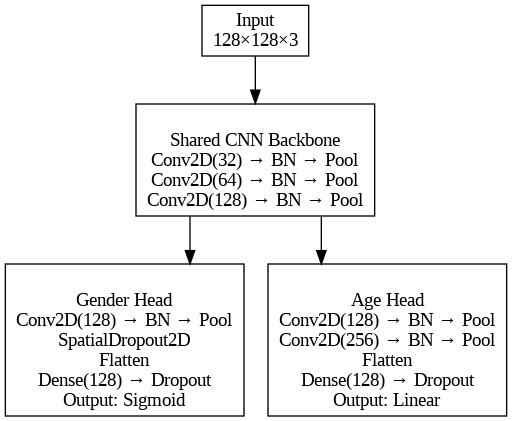
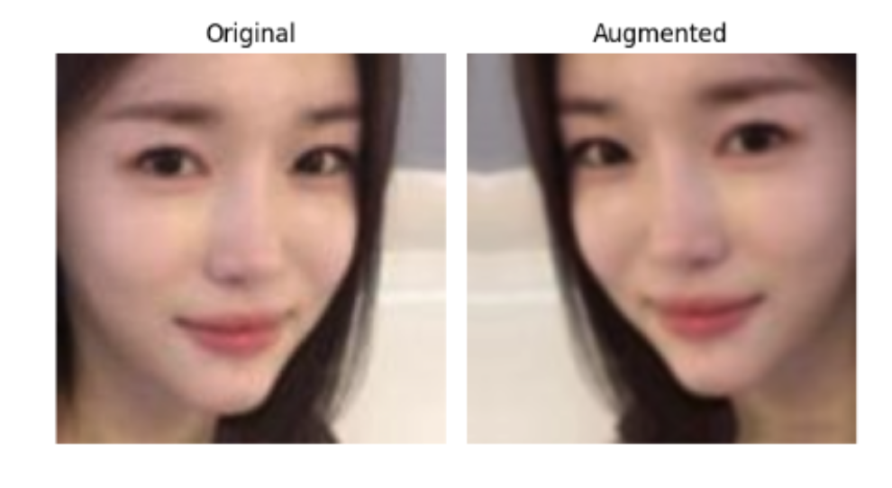
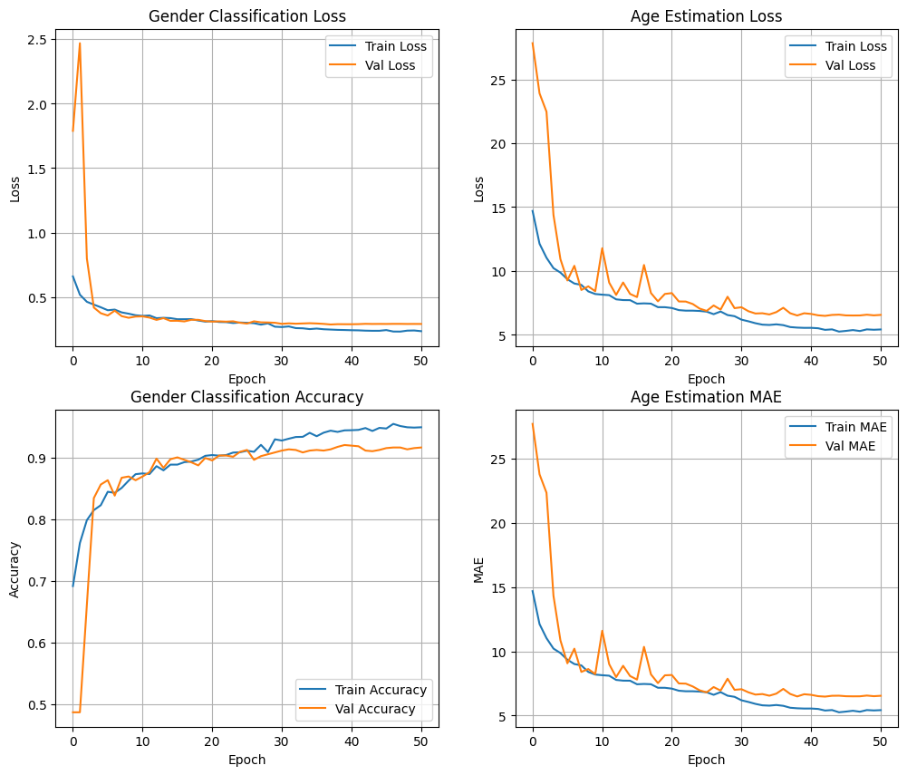
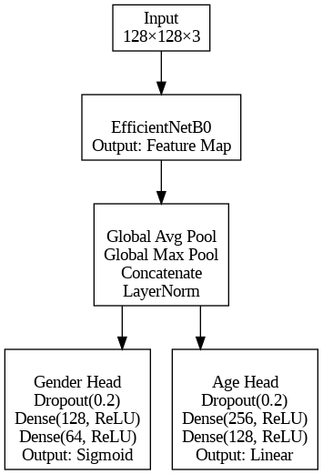
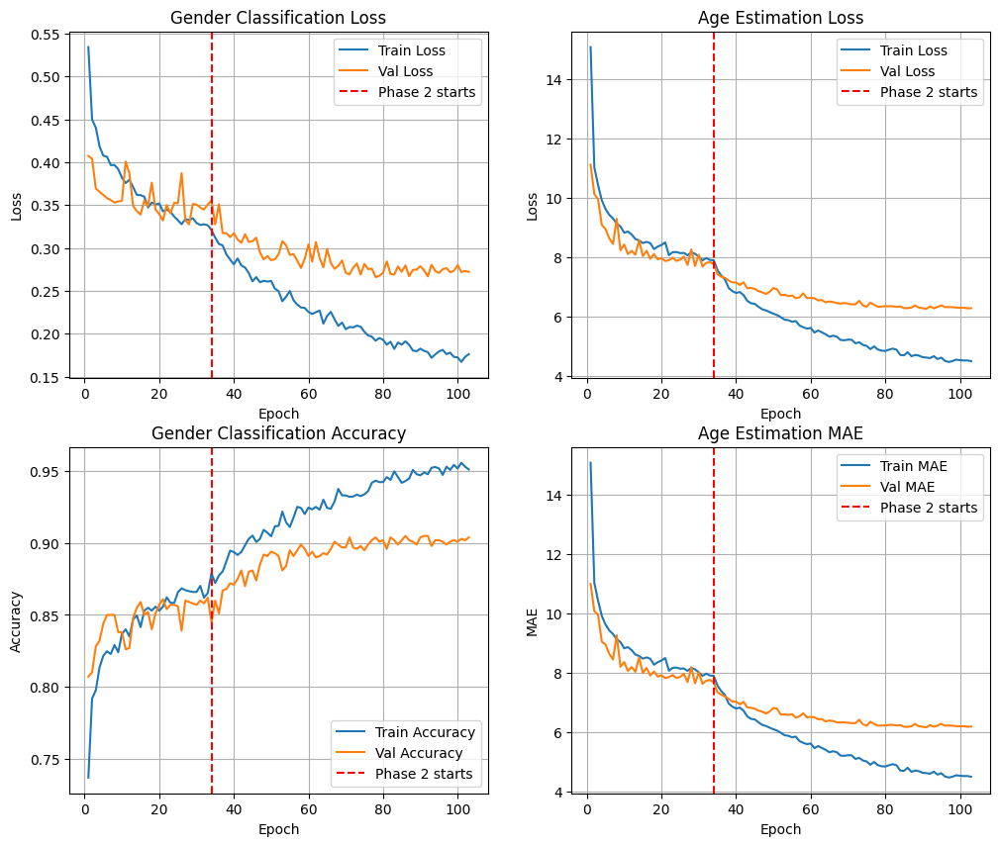

## 1.0 Introduction

This assignment is about developing and evaluating convolutional neural networks (CNNs) for two prediction tasks: **gender classification** and **age estimation** from facial images.

Two models are assessed throughout this report:

- **Model A:** a custom CNN built and trained from scratch  
- **Model B:** a pre-trained network fine-tuned on the same dataset  

The assignment evaluates:
- Training behaviour  
- Training stability  
- Overfitting/underfitting tendencies  
- Gender prediction accuracy  
- MAE for age estimation  

Sections 2 & 3 explain the CNN architectures, training process, hyperparameters, and performance.  
Section 4 gives a comparative summary of the two models and key insights.

## 2.0 The Custom CNN

### 2.1 Architecture Description

Model A uses a **shared convolutional backbone** that feeds into two task-specific heads for age estimation and gender classification.

Backbone structure:
- Three convolutional blocks: **32, 64, 128 filters**
- 3×3 kernels  
- ReLU activations  
- Each block followed by Batch Normalisation and 2×2 MaxPooling  

Gender classification head:
- One additional conv block (128 filters)
- BatchNorm + 2×2 MaxPooling  
- `SpatialDropout2D` (rate 0.1)  
- Flatten → Dense(128, L2 regularisation) → Dropout(0.4)  
- Sigmoid output  

Age regression head:
- Two additional conv blocks (128 and 256 filters)
- BatchNorm + MaxPooling  
- Flatten → Dense(128, L2 regularisation) → Dropout(0.3)  
- Linear output  

**Figure 1 — Model A Architecture**  

### 2.2 Training Procedure

The model was trained on 5000 images, with 4000 used for training and 1000 for validation. Data augmentation was applied on-the-fly during training using horizontal flips, small rotations, zoom, translation, and adjustments to contrast and brightness.

**Figure 2. Comparison between an original and an augmented image**  

The model was trained using the Adam optimiser with a learning rate of 2×10⁻⁴ and uses multi-task loss. This includes binary cross-entropy with label smoothing for gender classification and mean absolute error (MAE) for age regression. Loss weights of 1.0 (gender) and 0.3 (age) were used to prevent the regression loss from dominating, given its larger numeric scale.

Training was performed with a batch size of 32 for up to 80 epochs. `EarlyStopping` and `ReduceLROnPlateau` were applied when validation loss stagnated to stop training and to reduce the learning rate to stabilise optimisation.

### 2.3 Performance Analysis

Model A performed strongly on gender classification, reaching a training accuracy of 96.96% and a validation accuracy of 92.10%. The curves (Figure 3) show that loss decreases rapidly between 0–5 epochs before stabilising and gradually converging. The validation and training curves are closely in line throughout and finish with a mild delta of −4.860% between validation and training accuracy, suggesting no severe overfitting.

The age estimation curves were much noisier. Despite this, the validation curve broadly tracks the training curve for both loss and MAE, indicating reasonable generalisation. Both curves converge smoothly between 40–50 epochs with a final training MAE of 4.26 and a validation MAE of 6.52. This shows a moderate delta of 2.27, reflecting the increased difficulty of the task but not suggesting severe overfitting.

**Figure 3. Learning curve figures for Model A, including gender classification loss, gender classification accuracy, age estimation loss, and age estimation MAE.**  

**Table 1. Training and validation performance metrics for Model A**

| Task   | Metric | Training | Validation | Δ (val–train) |
|--------|--------|----------|------------|---------------|
| Gender | Accuracy | 96.96% | 92.10% | −4.860% |
| Gender | Loss    | 0.203  | 0.286  | 0.083  |
| Age    | MAE     | 4.257  | 6.517  | 2.26   |
| Age    | Loss    | 4.257  | 6.518  | 2.27   |

## 3.0 The Pre-Trained CNN

### 3.1 Architecture Description

Model B is built on top of EfficientNetB0 as the backbone to extract convolutional features. The output is reduced with two global pooling operations, including Global Average Pooling (GAP) and Global Max Pooling (GMP). Concatenating both provides a more expressive feature vector than either method alone (Woo et al., 2018), though it doubles the feature vector size. A layer normalisation layer is applied afterwards to stabilise the scale of the combined feature vector values.

The network splits into two task-specific heads. The gender head applies dropout (rate 0.2) followed by two fully connected dense layers with 128 and 64 units respectively, ReLU activations, and outputs a single probability using sigmoid activation. The age head has the same structure but with larger dense heads of 256 and 128 units, and outputs the age estimation with a linear activation.

**Figure 4. Model B Architecture Diagram**  

 ### 3.2 Training Procedure

Model B was trained using the same dataset, train/validation split, and data augmentation pipeline as Model A described in Section 2.2. Training was carried out in two phases. In the first phase, the entire backbone was frozen, and only the task-specific heads were trained. In the second phase, the last 120 layers of the backbone were unfrozen to allow fine-tuning of deeper convolutional blocks alongside the task-specific heads.

The model was compiled with the Adam optimiser, with a learning rate of 1×10⁻⁴ in phase 1 and a reduced rate of 1×10⁻⁵ during phase 2 to help prevent large updates from destabilising the pre-trained weights. Binary cross-entropy with label smoothing was used for gender classification, and MAE for age regression, with loss weights of 1.0 and 0.2, respectively. Phase 1 trained for up to 40 epochs using `EarlyStopping`, `ReduceLROnPlateau`, and `ModelCheckpoint` to retain the best-performing weights. The same setup was used in phase 2, but was allowed to run for up to 80 epochs to give the slower fine-tuning process enough time to converge.

### 3.3 Performance Analysis

Model B achieved strong performance on gender classification, reaching a training accuracy of 96.72% and a validation accuracy of 91.02% indicating good generalisation. The gender curves were much noisier in phase 1, but the overall downward trend is clear before `EarlyStopping` is triggered at epoch 33. In phase 2, the curves stabilised, and a more consistent decline in training loss is seen. The final validation and training accuracy delta is −5.7% indicating mild overfitting.

Age estimation exhibited much smoother training curves across both phases, with the training and validation curves staying closely aligned. Most of the improvement occurred in phase 1, and in phase 2, the training curve improved more rapidly than the validation curve, although both showed meaningful reductions. The curves converged smoothly with a final training MAE of 4.04 and validation MAE of 6.02, indicating mild overfitting.

**Figure 5. Learning curve figures for Model B, including gender classification loss, gender classification accuracy, age estimation loss, and age estimation MAE.**  

**Table 2. Training and validation performance metrics for Model B**

| Task   | Metric | Training | Validation | Δ (val–train) |
|--------|--------|----------|------------|---------------|
| Gender | Accuracy | 96.72% | 91.02% | −5.700% |
| Gender | Loss    | 0.148  | 0.252  | 0.104  |
| Age    | MAE     | 4.040  | 6.017  | 1.977  |
| Age    | Loss    | 4.040  | 6.023  | 1.983  |

## 4.0 Summary and Discussion

Overall, both models successfully learned both tasks. Model A achieved slightly higher validation accuracy (+1.08%) in gender classification, while Model B achieved lower validation age MAE (−0.50). Interestingly, the learning curves in Model A show noisier training dynamics for age, whereas those in Model B show noisier training dynamics for gender. This could indicate that, by unfreezing only the top 120 layers of the backbone, Model B struggled to learn lower-level facial features useful for gender classification but excelled at adapting the pre-trained features to age. In contrast, Model A struggled to extract generic higher-level facial features useful for age estimation, likely due to its lower capacity.

The main strength of Model A was having full control over the architecture, which was tailored to the two tasks and data size. Using hard parameter sharing, Model A employed a shared convolutional backbone, which helped mitigate overfitting by extracting generic low-level facial features useful to both tasks (Ruder, 2017). It also had a deeper convolutional design in the age head to reflect the increased complexity of the regression task. With fewer parameters, experimentation was much faster and had lower memory requirements.

In contrast, Model B had less flexibility and relies on pre-trained features, which are not fully aligned with facial age/gender cues, likely introducing ImageNet biases. However, the pre-trained backbone provided much richer and more discriminative features than what could be learned with 4000 images alone, demonstrated by the smoother optimisation and improved generalisation of the age task. Because of this, Model B would likely perform better in a real-world scenario as it has learned diverse features from millions of images in ImageNet.

One of the biggest improvements to both models would be using a larger and more diverse dataset. With the current size, both models show mild overfitting and are limited in the variety of faces they can generalise. Model B could be improved with a more controlled fine-tuning process, for example, by using a learning rate scheduler and by gradually unfreezing more layers. This could help the model to adapt more effectively to the tasks, while taking measures to ensure the pre-trained weights are not destabilised.

Model A could also be improved with a slightly deeper design to improve its feature extraction capability, and by experimenting with stronger regularisation in the age head to stabilise optimisation.

In real-world use, age and gender prediction models must handle far greater variation in ethnicities, lighting, pose, and image quality to avoid bias and unreliable predictions. This highlights that when applying deep learning to real-life problems, good performance in a controlled setting does not guarantee robustness or reliability in real-world deployment.